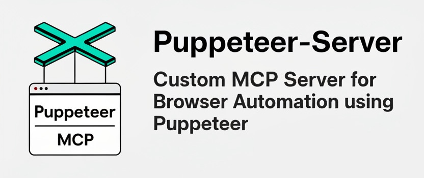

# Puppeteer Server - Custom MCP Server

<p align="center">
  
</p>

<p align="center">
  
  
  
  
</p>

A Model Context Protocol (MCP) server that provides secure browser automation capabilities using Puppeteer. This server enables LLMs to interact with web pages, take screenshots, and execute JavaScript in a real browser environment with enterprise-grade security features.

> 🇪🇸 **[Versión en Español](README_es.md)** | 🇺🇸 **English Version** | 🤖 **[Agent Setup Guide](README_FOR_AGENTS.md)**

## 🚀 Features

- **Secure Web Navigation**: Navigate only to whitelisted domains
- **Screenshot Capture**: Take screenshots with size limits and optimization
- **Element Interaction**: Click, fill forms, select options, and hover
- **JavaScript Execution**: Execute custom code in the browser context
- **Console Monitoring**: Capture and access browser console logs
- **Flexible Configuration**: Customizable Puppeteer launch options
- **🔒 Advanced Security**: Rate limiting, timeouts, audit logging, and sandboxing
- **📊 Structured Logging**: Complete audit trail of all operations
- **🐳 Secure Docker**: Hardened container configuration

## ⚙️ MCP Configuration

Being an MCP server, the primary way to use Puppeteer Server is through MCP client configuration:

### Method 1: Using NPX (Recommended)

```json
{
  "mcpServers": {
    "puppeteer-server": {
      "command": "npx",
      "args": ["-y", "puppeteer-server"],
      "env": {
        "ALLOWED_ORIGINS": "https://example.com,https://*.trusted.org",
        "PUPPETEER_LAUNCH_OPTIONS": "{ \"headless\": false, \"defaultViewport\": { \"width\": 1280, \"height\": 720 } }",
        "ALLOW_DANGEROUS": "false"
      }
    }
  }
}
```

### Method 2: Using Local Build

```json
{
  "mcpServers": {
    "puppeteer-server-local": {
      "command": "/opt/homebrew/bin/node",
      "args": ["/absolute/path/to/puppeteer-server/dist/index.js"],
      "env": {
        "ALLOWED_ORIGINS": "https://github.com,https://*.github.io",
        "MAX_SCREENSHOT_SIZE": "2097152",
        "MAX_CONTENT_LENGTH": "1048576",
        "TOOL_TIMEOUT": "30000",
        "ALLOW_DANGEROUS": "false",
        "PUPPETEER_LAUNCH_OPTIONS": "{ \"headless\": false, \"defaultViewport\": { \"width\": 1920, \"height\": 1080 } }"
      }
    }
  }
}
```

### Environment Variables

- `PUPPETEER_LAUNCH_OPTIONS`: Launch options in JSON format
- `ALLOWED_ORIGINS`: Comma-separated list of allowed domains
- `ALLOW_DANGEROUS`: Allow dangerous arguments (`true`/`false`)
- `MAX_SCREENSHOT_SIZE`: Maximum screenshot size in bytes
- `MAX_CONTENT_LENGTH`: Maximum HTML content length
- `TOOL_TIMEOUT`: Timeout per tool operation in milliseconds

## HTTP/SSE mode

The server can run over HTTP using **Server-Sent Events** when `MCP_TRANSPORT=http`. Useful for n8n or other MCP clients that communicate over HTTP.

### Environment variables

- `MCP_TRANSPORT`: set to `http` to enable HTTP mode (defaults to `stdio`).
- `PORT`: listening port (default `3333`).
- `MCP_BEARER`: optional bearer token required in `Authorization` header.
- `ALLOWED_ORIGINS`: comma-separated whitelist of allowed `Origin` headers (`*` to allow any in development).
- `MCP_BODY_LIMIT`: max JSON body size accepted by `/messages` (default `1mb`).

### Quick start

```bash
pnpm build
MCP_TRANSPORT=http PORT=3333 node dist/index.js
```

Verify the SSE endpoint:

```bash
curl -I -H 'Accept: text/event-stream' http://localhost:3333/sse
```

A basic health check is available at `GET /health`.

For STDIO mode (default):

```bash
pnpm build
npx @modelcontextprotocol/inspector --cli node dist/index.js --method tools/list
```

## 🛠️ Local Installation & Testing

For local development and testing purposes:

### Quick Start with NPX

```bash
# Use directly without installation
npx puppeteer-server
```

### Local Development Setup

```bash
# Clone and build the project
git clone https://github.com/tecnomanu/puppeteer-server.git
cd puppeteer-server
pnpm install
pnpm run build
```

### Development Mode

```bash
pnpm run dev
```

### Local Testing (without Cursor)

**Build and run:**
```bash
pnpm i
pnpm build
node dist/index.js
```
You should see "Puppeteer MCP Server started successfully".

**Test with MCP Inspector (UI):**
```bash
npx @modelcontextprotocol/inspector node dist/index.js
```
Opens UI at http://localhost:6274; there you'll see tools/resources/prompts and can call them from the Tools tab. Usage examples and environment variable passing are in the inspector README.
[GitHub - modelcontextprotocol.io](https://github.com/modelcontextprotocol/inspector)

**Test with MCP Inspector (CLI):**
```bash
npx @modelcontextprotocol/inspector --cli node dist/index.js --method tools/list
```
You should get the list of tools exposed by your server.

## 📋 Available Tools

### `puppeteer_navigate`

Navigate to a specific URL.

**Parameters:**
- `url` (string, required): URL to navigate to
- `launchOptions` (object, optional): Puppeteer launch options
- `allowDangerous` (boolean, optional): Allow dangerous options

### `puppeteer_screenshot`

Take screenshots of pages or specific elements.

**Parameters:**
- `name` (string, required): Name for the screenshot
- `selector` (string, optional): CSS selector for specific element
- `width` (number, optional): Width in pixels (default: 800)
- `height` (number, optional): Height in pixels (default: 600)
- `encoded` (boolean, optional): Return as base64 data URI

### `puppeteer_click`

Click on an element.

**Parameters:**
- `selector` (string, required): CSS selector of the element

### `puppeteer_fill`

Fill input fields.

**Parameters:**
- `selector` (string, required): CSS selector of the field
- `value` (string, required): Value to input

### `puppeteer_select`

Select options in SELECT elements.

**Parameters:**
- `selector` (string, required): CSS selector of the SELECT element
- `value` (string, required): Value to select

### `puppeteer_hover`

Hover over an element.

**Parameters:**
- `selector` (string, required): CSS selector of the element

### `puppeteer_evaluate`

Execute JavaScript in the browser console.

**Parameters:**
- `script` (string, required): JavaScript code to execute

### `puppeteer_wait_for_selector`

Wait for an element to appear.

**Parameters:**
- `selector` (string, required): CSS selector of the element
- `timeout` (number, optional): Timeout in milliseconds (default: 30000)

### `puppeteer_get_page_content`

Get the HTML content of the page.

**Parameters:**
- `selector` (string, optional): Specific selector for partial content

## 📦 Resources

### Console Logs (`console://logs`)

Access to all browser console logs in text format.

### Screenshots (`screenshot://<name>`)

Access to captured screenshots, identified by name.


## 🛡️ Security

This server implements multiple security layers to protect against attacks and malicious usage:

### 🚫 Domain Whitelist

**MANDATORY**: Configure `ALLOWED_ORIGINS` to limit accessible domains:

```bash
# Production examples
export ALLOWED_ORIGINS="https://example.com,https://*.example.org,https://api.trusted-site.com"

# Development only (DO NOT use in production)
export ALLOWED_ORIGINS="*"
```

### ⚡ Rate Limiting

- Maximum 30 requests per minute per tool
- Automatic protection against denial-of-service attacks
- Configurable via environment variables

### ⏱️ Timeouts and Limits

```bash
export TOOL_TIMEOUT=30000           # 30s timeout per tool
export MAX_SCREENSHOT_SIZE=2097152  # 2MB max for screenshots
export MAX_CONTENT_LENGTH=1048576   # 1MB max for HTML content
```

### 🔒 Dangerous Arguments

Arguments blocked by default (require `ALLOW_DANGEROUS=true`):

- `--no-sandbox`, `--disable-setuid-sandbox`
- `--single-process`, `--disable-web-security`
- `--ignore-certificate-errors`
- `--remote-debugging-port`, `--remote-debugging-address`
- Other security-reducing arguments

### 📋 Audit and Logging

All logs are structured in JSON format for analysis:

```json
{
  "timestamp": "2024-01-01T12:00:00.000Z",
  "level": "AUDIT",
  "service": "puppeteer-server",
  "toolName": "puppeteer_navigate",
  "success": true,
  "duration": 1250,
  "resourceHash": "a1b2c3d4e5f6g7h8"
}
```

### 🐳 Secure Docker

Hardened Docker configuration included:

```bash
# Secure build
docker build -t puppeteer-server .

# Maximum security execution
docker run --cap-drop=ALL \
  --security-opt=no-new-privileges:true \
  --user 1001:1001 \
  --read-only \
  --tmpfs /tmp \
  -e ALLOWED_ORIGINS="https://example.com" \
  -e ALLOW_DANGEROUS=false \
  puppeteer-server

# Or use docker-compose with security configuration
docker-compose -f docker-compose.security.yml up
```

### ⚠️ Security Warnings

1. **NEVER** use `ALLOWED_ORIGINS="*"` in production
2. **ALWAYS** run in containers with non-privileged users
3. **AVOID** `--no-sandbox` arguments unless absolutely necessary
4. **MONITOR** audit logs regularly
5. **UPDATE** dependencies regularly

## 🧪 Testing

The project includes a comprehensive test suite with **43 test cases**:

- **Unit Tests**: Validation of security functions and individual tools
- **Integration Tests**: Complete MCP server verification
- **Configuration Tests**: Validation of configuration examples

```bash
# Run all tests
pnpm test

# Tests with code coverage
pnpm run test:coverage

# Development mode tests (watch)
pnpm run test:watch
```

### 📊 Test Coverage

Tests cover:
- ✅ Domain and origin validation
- ✅ Rate limiting and timeouts
- ✅ Hash generation and auditing
- ✅ Security configuration
- ✅ Individual MCP tools
- ✅ Error handling and exceptions
- ✅ Configuration example validation

## 📁 Configuration Examples

The `examples/` folder contains ready-to-use configurations:

| File | Description | Recommended Use |
|------|-------------|----------------|
| `mcp-config-example.json` | Basic configuration | Local development |
| `mcp-config-secure-example.json` | Secure configuration | Production |
| `docker-mcp-config.json` | With Docker hardening | Containers |
| `claude-desktop-config.json` | Optimized for Claude | Claude Desktop |

See [examples/README.md](examples/README.md) for complete details on each configuration.

## 🛠️ Development

```bash
# Development with watch mode
pnpm run dev

# Linting and code formatting
pnpm run lint          # Fix errors automatically
pnpm run lint:check    # Only check errors
pnpm run format        # Format code with Prettier
pnpm run format:check  # Check formatting

# Testing
pnpm test              # Run all tests
pnpm run test:watch    # Tests in watch mode
pnpm run test:coverage # Tests with coverage report

# Build
pnpm run build
```

### 🔧 Quality Tools

- **ESLint**: Static analysis with security rules
- **Prettier**: Consistent code formatting
- **Jest**: Testing framework with coverage
- **Husky**: Pre-commit hooks for quality
- **TypeScript**: Static typing and compilation


## 🤝 Contributing

Contributions are welcome! Please follow our process:

- **Fork** → create feature branch (`feat/your-feature`)
- **Test** → run `pnpm test` & ensure all checks pass
- **Document** → update docs and add examples if needed
- **PR** → open with context: why + screenshots/logs

📋 Please read our [Contributing Guide](CONTRIBUTING.md) and [Code of Conduct](CODE_OF_CONDUCT.md) before contributing.

All discussions happen on **GitHub Issues**.

## 🐛 Troubleshooting

### Browser doesn't open

- Verify Chrome/Chromium is installed
- Check execution permissions
- Review launch options

### Timeout errors

- Increase timeout value in `puppeteer_wait_for_selector`
- Verify the page loads correctly
- Check network connectivity

### Screenshot issues

- Ensure the page is fully loaded
- Verify the CSS selector is correct
- Check viewport dimensions

## 🔗 Additional Resources

- **Spanish documentation**: [README_es.md](README_es.md)
- **Agent setup guide**: [README_FOR_AGENTS.md](README_FOR_AGENTS.md)
- **Project repository**: https://github.com/tecnomanu/puppeteer-server
- **MCP Protocol**: https://modelcontextprotocol.io/


## 📄 License

**MIT** – do whatever you want, just keep the copyright.

**Happy coding!** 💙

---

🇦🇷 **Made with ❤️ in Argentina**