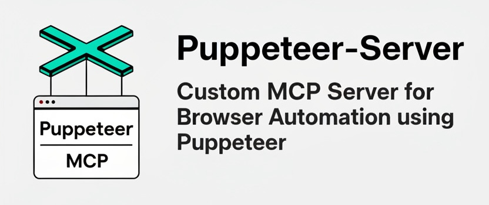

<p align="center">
  
</p>

<p align="center">
  
  
  
  
</p>

# Puppeteer Server - Servidor MCP Personalizado

Un servidor del Protocolo de Contexto de Modelo (MCP) que proporciona capacidades de automatización de navegadores usando Puppeteer. Este servidor permite a los LLMs interactuar con páginas web, tomar capturas de pantalla y ejecutar JavaScript en un entorno de navegador real con características de seguridad de nivel empresarial.

> 🇪🇸 **Versión en Español** | 🇺🇸 **[English Version](README.md)** | 🤖 **[Guía para Agentes](README_FOR_AGENTS.md)**

## 🚀 Características

-   **Navegación web segura**: Navegar solo a dominios permitidos (whitelist)
-   **Capturas de pantalla**: Capturar imágenes con límites de tamaño
-   **Interacción con elementos**: Hacer clic, rellenar formularios, seleccionar opciones
-   **Ejecución de JavaScript**: Ejecutar código personalizado en el navegador
-   **Monitoreo de consola**: Capturar logs del navegador
-   **Configuración flexible**: Opciones personalizables de Puppeteer
-   **🔒 Seguridad avanzada**: Rate limiting, timeouts, auditoría y sandbox
-   **📊 Logging estructurado**: Auditoría completa de todas las operaciones
-   **🐳 Docker seguro**: Configuración hardened para contenedores

## ⚙️ Configuración MCP

Siendo un servidor MCP, la forma principal de usar Puppeteer Server es a través de la configuración del cliente MCP:

### Método 1: Usando NPX (Recomendado)

```json
{
  "mcpServers": {
    "puppeteer-server": {
      "command": "npx",
      "args": ["-y", "puppeteer-server"],
      "env": {
        "ALLOWED_ORIGINS": "https://example.com,https://*.trusted.org",
        "PUPPETEER_LAUNCH_OPTIONS": "{ \"headless\": false, \"defaultViewport\": { \"width\": 1280, \"height\": 720 } }",
        "ALLOW_DANGEROUS": "false"
      }
    }
  }
}
```

### Método 2: Usando Build Local

```json
{
  "mcpServers": {
    "puppeteer-server-local": {
      "command": "/opt/homebrew/bin/node",
      "args": ["/ruta/absoluta/a/puppeteer-server/dist/index.js"],
      "env": {
        "ALLOWED_ORIGINS": "https://github.com,https://*.github.io",
        "MAX_SCREENSHOT_SIZE": "2097152",
        "MAX_CONTENT_LENGTH": "1048576",
        "TOOL_TIMEOUT": "30000",
        "ALLOW_DANGEROUS": "false",
        "PUPPETEER_LAUNCH_OPTIONS": "{ \"headless\": false, \"defaultViewport\": { \"width\": 1920, \"height\": 1080 } }"
      }
    }
  }
}
```

### Variables de Entorno

- `PUPPETEER_LAUNCH_OPTIONS`: Opciones de lanzamiento en formato JSON
- `ALLOWED_ORIGINS`: Lista separada por comas de dominios permitidos
- `ALLOW_DANGEROUS`: Permitir argumentos peligrosos (`true`/`false`)
- `MAX_SCREENSHOT_SIZE`: Tamaño máximo de captura de pantalla en bytes
- `MAX_CONTENT_LENGTH`: Longitud máxima de contenido HTML
- `TOOL_TIMEOUT`: Timeout por operación de herramienta en milisegundos

## 🛠️ Instalación Local y Testing

Para propósitos de desarrollo local y testing:

### Inicio Rápido con NPX

```bash
# Usar directamente sin instalación
npx puppeteer-server
```

### Configuración para Desarrollo Local

```bash
# Clonar y construir el proyecto
git clone https://github.com/tecnomanu/puppeteer-server.git
cd puppeteer-server
pnpm install
pnpm run build
```

### Modo Desarrollo

```bash
pnpm run dev
```

### Comprobación Local (sin Cursor)

**Build y ejecuta:**
```bash
pnpm i
pnpm build
node dist/index.js
```
Deberías ver "Servidor MCP Puppeteer iniciado correctamente".

**Probar con MCP Inspector (UI):**
```bash
npx @modelcontextprotocol/inspector node dist/index.js
```
Se abre la UI en http://localhost:6274; ahí vas a ver tools/resources/prompts y podés llamarlos desde la pestaña Tools. Ejemplos de uso y paso de variables de entorno están en el README del inspector.
[GitHub - modelcontextprotocol.io](https://github.com/modelcontextprotocol/inspector)

**Probar con MCP Inspector (CLI):**
```bash
npx @modelcontextprotocol/inspector --cli node dist/index.js --method tools/list
```
Deberías obtener el listado de herramientas expuestas por tu server.

## 📋 Herramientas Disponibles

### `puppeteer_navigate`

Navegar a una URL específica.

**Parámetros:**

-   `url` (string, requerido): URL a la que navegar
-   `launchOptions` (object, opcional): Opciones de lanzamiento de Puppeteer
-   `allowDangerous` (boolean, opcional): Permitir opciones peligrosas

### `puppeteer_screenshot`

Tomar capturas de pantalla de la página o elementos específicos.

**Parámetros:**

-   `name` (string, requerido): Nombre para la captura
-   `selector` (string, opcional): Selector CSS del elemento
-   `width` (number, opcional): Ancho en píxeles (por defecto: 800)
-   `height` (number, opcional): Alto en píxeles (por defecto: 600)
-   `encoded` (boolean, opcional): Retornar como data URI base64

### `puppeteer_click`

Hacer clic en un elemento.

**Parámetros:**

-   `selector` (string, requerido): Selector CSS del elemento

### `puppeteer_fill`

Rellenar campos de entrada.

**Parámetros:**

-   `selector` (string, requerido): Selector CSS del campo
-   `value` (string, requerido): Valor a introducir

### `puppeteer_select`

Seleccionar opciones en elementos SELECT.

**Parámetros:**

-   `selector` (string, requerido): Selector CSS del SELECT
-   `value` (string, requerido): Valor a seleccionar

### `puppeteer_hover`

Pasar el cursor sobre un elemento.

**Parámetros:**

-   `selector` (string, requerido): Selector CSS del elemento

### `puppeteer_evaluate`

Ejecutar JavaScript en la consola del navegador.

**Parámetros:**

-   `script` (string, requerido): Código JavaScript a ejecutar

### `puppeteer_wait_for_selector`

Esperar a que aparezca un elemento.

**Parámetros:**

-   `selector` (string, requerido): Selector CSS del elemento
-   `timeout` (number, opcional): Tiempo de espera en ms (por defecto: 30000)

### `puppeteer_get_page_content`

Obtener el contenido HTML de la página.

**Parámetros:**

-   `selector` (string, opcional): Selector específico para obtener contenido parcial

## 📦 Recursos

### Console Logs (`console://logs`)

Acceso a todos los logs de la consola del navegador en formato texto.

### Screenshots (`screenshot://<name>`)

Acceso a las capturas de pantalla tomadas, identificadas por su nombre.


## 🛡️ Seguridad

Este servidor implementa múltiples capas de seguridad para proteger contra ataques y uso malicioso:

### 🚫 Lista Blanca de Dominios

**OBLIGATORIO**: Configure `ALLOWED_ORIGINS` para limitar los dominios accesibles:

```bash
# Ejemplos de producción
export ALLOWED_ORIGINS="https://example.com,https://*.example.org,https://api.trusted-site.com"

# Para desarrollo (NO usar en producción)
export ALLOWED_ORIGINS="*"
```

### ⚡ Rate Limiting

-   Máximo 30 solicitudes por minuto por herramienta
-   Protección automática contra ataques de denegación de servicio
-   Configuración personalizable via variables de entorno

### ⏱️ Timeouts y Límites

```bash
export TOOL_TIMEOUT=30000           # Timeout por herramienta (30s)
export MAX_SCREENSHOT_SIZE=2097152  # Máximo 2MB para capturas
export MAX_CONTENT_LENGTH=1048576   # Máximo 1MB para contenido HTML
```

### 🔒 Argumentos Peligrosos

Argumentos bloqueados por defecto (requieren `ALLOW_DANGEROUS=true`):

-   `--no-sandbox`, `--disable-setuid-sandbox`
-   `--single-process`, `--disable-web-security`
-   `--ignore-certificate-errors`
-   `--remote-debugging-port`, `--remote-debugging-address`
-   Y otros argumentos que reducen la seguridad

### 📋 Auditoría y Logging

Todos los logs son estructurados en formato JSON para análisis:

```json
{
	"timestamp": "2024-01-01T12:00:00.000Z",
	"level": "AUDIT",
	"service": "puppeteer-server",
	"toolName": "puppeteer_navigate",
	"success": true,
	"duration": 1250,
	"resourceHash": "a1b2c3d4e5f6g7h8"
}
```

### 🐳 Docker Seguro

Configuración Docker hardened incluida:

```bash
# Construcción segura
docker build -t puppeteer-server .

# Ejecución con máxima seguridad
docker run --cap-drop=ALL \
  --security-opt=no-new-privileges:true \
  --user 1001:1001 \
  --read-only \
  --tmpfs /tmp \
  -e ALLOWED_ORIGINS="https://example.com" \
  -e ALLOW_DANGEROUS=false \
  puppeteer-server

# O usar docker-compose con configuración de seguridad
docker-compose -f docker-compose.security.yml up
```

### 🔧 Configuración de Seguridad Completa

```json
{
	"mcpServers": {
		"puppeteer-server": {
			"command": "node",
			"args": ["/ruta/a/puppeteer-server/dist/index.js"],
			"env": {
				"ALLOWED_ORIGINS": "https://example.com,https://*.trusted.org",
				"MAX_SCREENSHOT_SIZE": "1048576",
				"MAX_CONTENT_LENGTH": "524288",
				"TOOL_TIMEOUT": "20000",
				"ALLOW_DANGEROUS": "false",
				"NODE_ENV": "production"
			}
		}
	}
}
```

### ⚠️ Advertencias de Seguridad

1. **NUNCA** usar `ALLOWED_ORIGINS="*"` en producción
2. **SIEMPRE** ejecutar en contenedores con usuario no privilegiado
3. **EVITAR** argumentos `--no-sandbox` a menos que sea absolutamente necesario
4. **MONITOREAR** logs de auditoría regularmente
5. **ACTUALIZAR** dependencias regularmente

## 🧪 Testing

El proyecto incluye una suite completa de tests con **43 test cases**:

- **Tests Unitarios**: Validación de funciones de seguridad y herramientas individuales
- **Tests de Integración**: Verificación del servidor MCP completo  
- **Tests de Configuración**: Validación de ejemplos de configuración

```bash
# Ejecutar todos los tests
pnpm test

# Tests con cobertura de código
pnpm run test:coverage

# Tests en modo desarrollo (watch)
pnpm run test:watch
```

### 📊 Cobertura de Tests

Los tests cubren:
- ✅ Validación de orígenes y dominios permitidos
- ✅ Rate limiting y timeouts
- ✅ Generación de hashes y auditoría
- ✅ Configuración de seguridad
- ✅ Herramientas MCP individuales
- ✅ Manejo de errores y excepciones
- ✅ Validación de ejemplos de configuración

## 📁 Ejemplos de Configuración

La carpeta `examples/` contiene configuraciones listas para usar:

| Archivo | Descripción | Uso Recomendado |
|---------|-------------|----------------|
| `mcp-config-example.json` | Configuración básica | Desarrollo local |
| `mcp-config-secure-example.json` | Configuración segura | Producción |
| `docker-mcp-config.json` | Con Docker hardening | Contenedores |
| `claude-desktop-config.json` | Optimizado para Claude | Claude Desktop |

Ver [examples/README.md](examples/README.md) para detalles completos sobre cada configuración.

## 🛠️ Desarrollo

```bash
# Desarrollo con watch mode
pnpm run dev

# Linting y formato de código
pnpm run lint          # Corregir errores automáticamente
pnpm run lint:check    # Solo verificar errores
pnpm run format        # Formatear código con Prettier
pnpm run format:check  # Verificar formato

# Testing
pnpm test              # Ejecutar todos los tests
pnpm run test:watch    # Tests en modo watch
pnpm run test:coverage # Tests con reporte de cobertura

# Construcción
pnpm run build
```

### 🔧 Herramientas de Calidad

- **ESLint**: Análisis estático con reglas de seguridad
- **Prettier**: Formateo consistente de código
- **Jest**: Framework de testing con cobertura
- **Husky**: Pre-commit hooks para calidad
- **TypeScript**: Tipado estático y compilación

## 🤝 Contribuciones

¡Las contribuciones son bienvenidas! Por favor sigue nuestro proceso:

- **Fork** → crear rama de feature (`feat/tu-feature`)
- **Testing** → ejecutar `pnpm test` & asegurar que todos los checks pasen
- **Documentar** → actualizar docs y agregar ejemplos si es necesario
- **PR** → abrir con contexto: por qué + capturas/logs

📋 Por favor lee nuestra [Guía de Contribución](CONTRIBUTING.md) y [Código de Conducta](CODE_OF_CONDUCT.md) antes de contribuir.

Todas las discusiones suceden en **GitHub Issues**.

## 🐛 Resolución de Problemas

### El navegador no se abre

- Verifica que tienes Chrome/Chromium instalado
- Comprueba los permisos de ejecución
- Revisa las opciones de lanzamiento

### Errores de timeout

- Aumenta el valor de timeout en `puppeteer_wait_for_selector`
- Verifica que la página se carga correctamente
- Comprueba la conectividad de red

### Problemas con capturas de pantalla

- Asegúrate de que la página esté completamente cargada
- Verifica que el selector CSS sea correcto
- Comprueba las dimensiones de viewport

## 🔗 Recursos Adicionales

- **Documentación en inglés**: [README.md](README.md)
- **Guía para agentes**: [README_FOR_AGENTS.md](README_FOR_AGENTS.md)
- **Repositorio del proyecto**: https://github.com/tecnomanu/puppeteer-server
- **Protocolo MCP**: https://modelcontextprotocol.io/

## 📄 Licencia

**MIT** – haz lo que quieras, solo mantén el copyright.

**¡Feliz coding!** 💙

---

🇦🇷 **Hecho con ❤️ en Argentina**